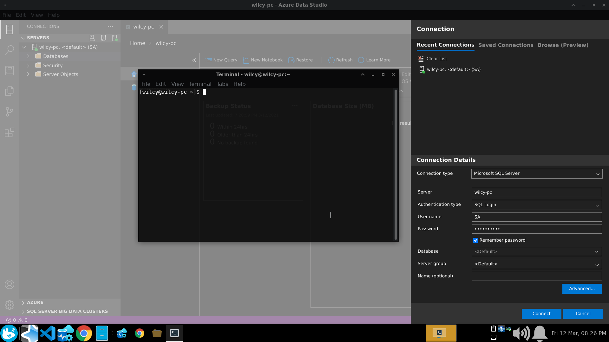
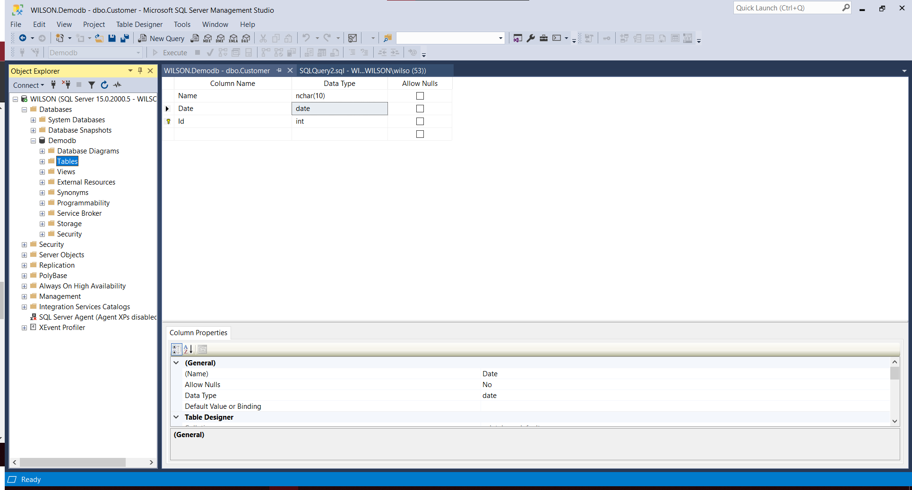
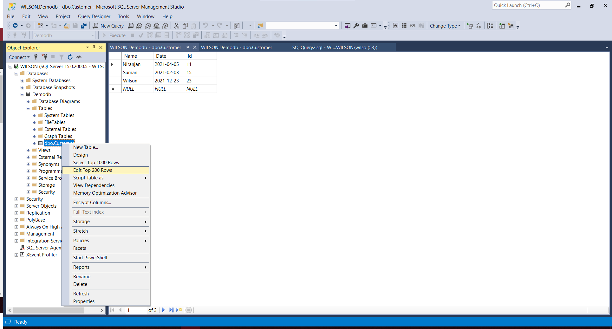
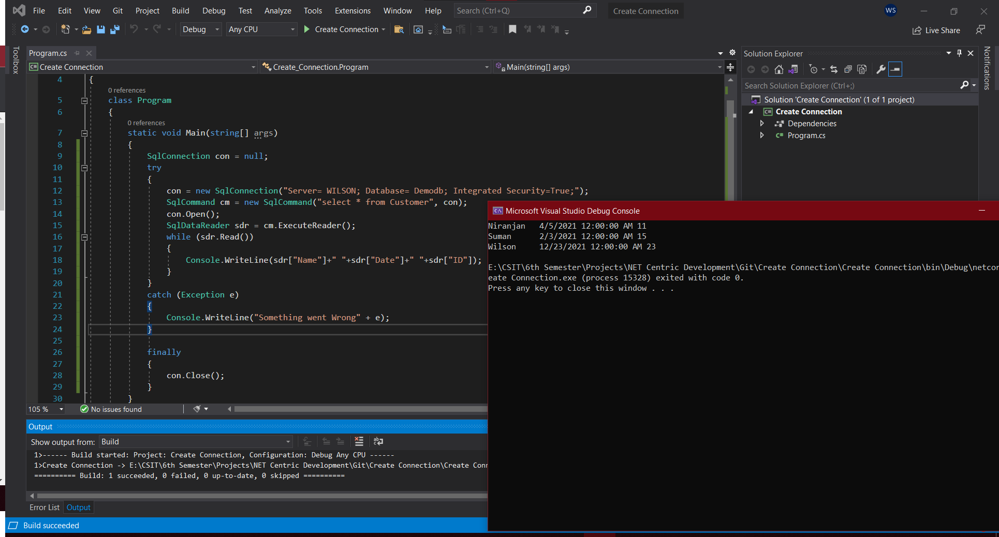
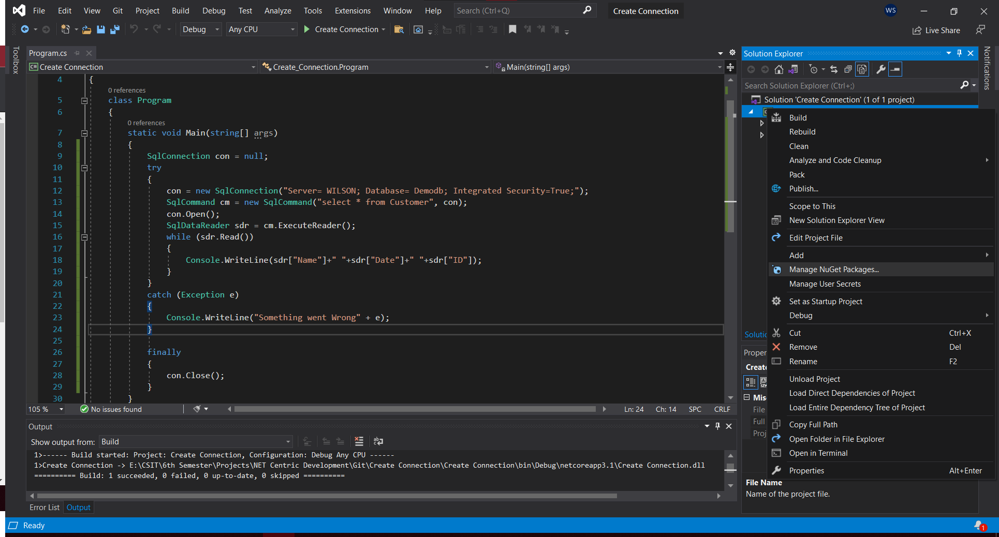
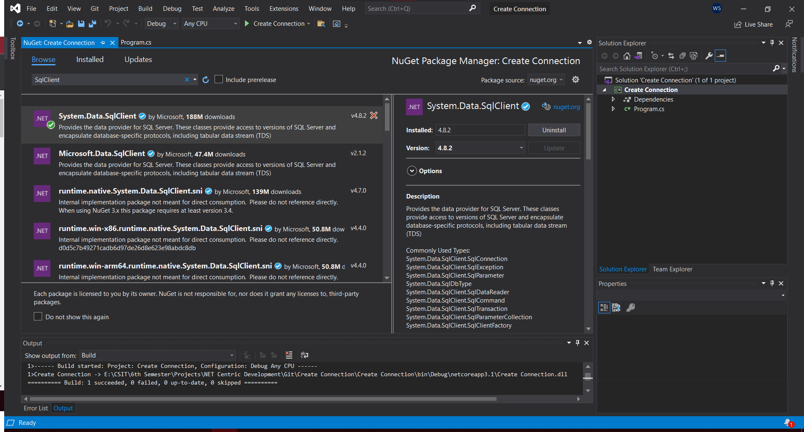

# NCC-Practical
## Enable Runtime Compilation in an existing project
### 1. Install the Microsoft.AspNetCore.Mvc.Razor.RuntimeCompilation NuGet package.
Through CLI. Use your current dotnet version. 
```console
dotnet add package Microsoft.AspNetCore.Mvc.Razor.RuntimeCompilation --version 5.0.3
```

To check your current dotnet version type.
```console
dotnet --info
```

### 2. Update the project's Startup.ConfigureServices method to include a call to AddRazorRuntimeCompilation. For example:
```cs
public void ConfigureServices(IServiceCollection services)
{
    services.AddRazorPages()
        .AddRazorRuntimeCompilation();

    // code omitted for brevity
}
```
## Enable Runtime Compilation at project creation
```console
dotnet new mvc --razor-runtime-compilation
```
## Installing SQL Server and Microsoft SQL Server Management Studio
### Download link for SQL Server
https://www.microsoft.com/en-us/sql-server/sql-server-downloads

Choose Express Edition. After installing SQL Server, it will automatically prompt for installing SQL Server Management Studio as install SSMD.

## Working with Databases

* In Linux, Server Name is the hostname and in Windows, the Server Name is the desktop name.
* In Linux, Authentication is SQL Authentication where Username and Password needs to be written. But, for Windows, the Windows Authenticationn doesn't require Username and Password.
* Default Username is SA which is System Administrator. And, Password is what we set during MSSQL installation in Linux.
* The Database column makes that database the default database while opening.

## Creating Database in SSMS and Adding Data to the Table



## Create Connection VS Output


## Installing System.Data.SqlClient Nuget Package to sue the different Classes of ADO.NET




